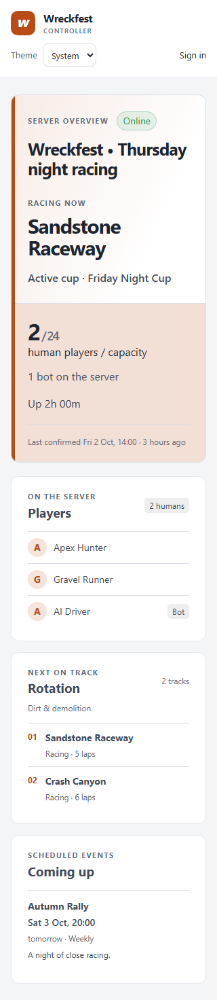
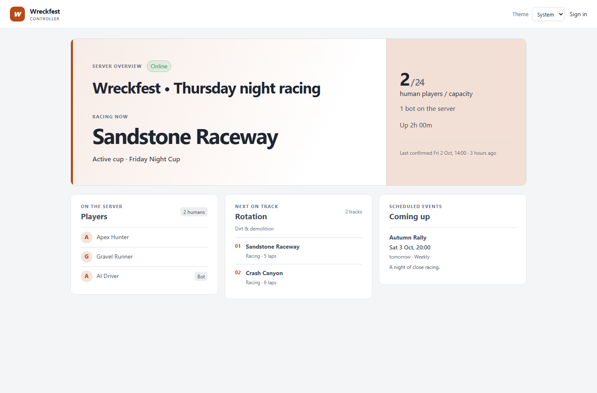
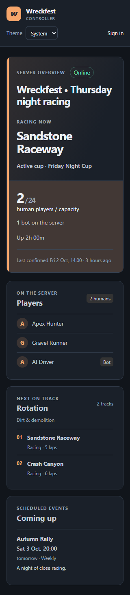
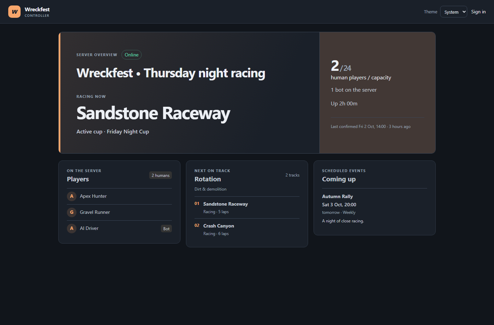

# Public Home redesign

These images come from the production Vue build with representative public API fixtures. The Home page stays anonymous.

| Theme | Mobile, 320px | Desktop, 1440px |
| --- | --- | --- |
| Light |  |  |
| Dark |  |  |

State checks at 320px:

| State | Light | Dark |
| --- | --- | --- |
| Offline | [Screenshot](offline-light-320.png) | [Screenshot](offline-dark-320.png) |
| Initial loading | [Screenshot](loading-light-320.png) | [Screenshot](loading-dark-320.png) |
| Stale after failed refresh | [Screenshot](stale-light-320.png) | [Screenshot](stale-dark-320.png) |
| Unavailable, no snapshot | [Screenshot](error-light-320.png) | [Screenshot](error-dark-320.png) |
| Sign-in | [Mobile](login-light-320.png), [desktop](login-light-1440.png) | [Mobile](login-dark-320.png), [desktop](login-dark-1440.png) |

The browser run also checked long player and rotation lists, document overflow, page errors, and the 404 link back to Home at 320px and 1440px in both themes.
