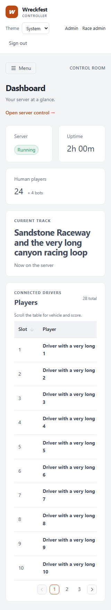
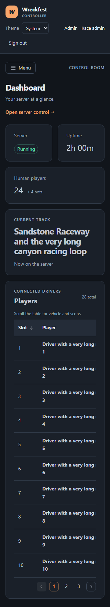
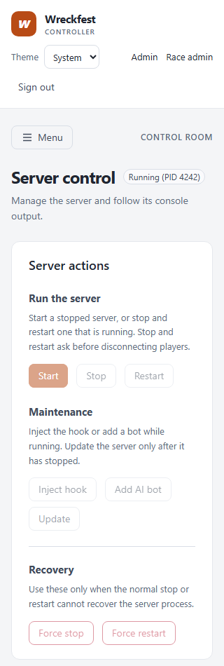
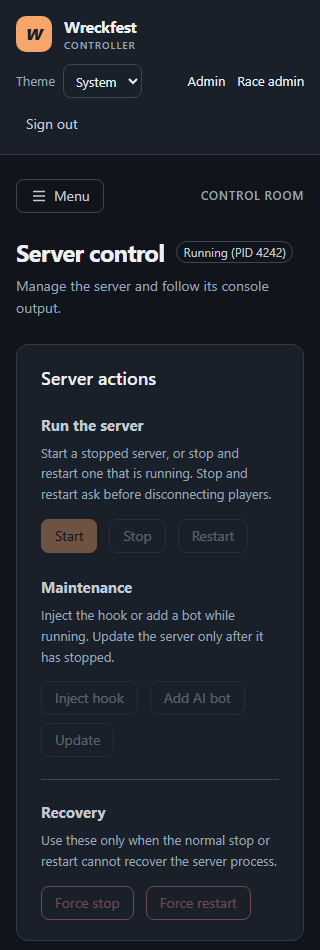

# Dashboard and server-control redesign

These screenshots use the production Vue build and fixture server responses. The running fixture has 28 drivers, long track and vehicle names, and 300 console lines.

| View | Light | Dark |
| --- | --- | --- |
| Dashboard, 320px |  |  |
| Dashboard, 1440px | [Screenshot](dashboard-running-light-1440.png) | [Screenshot](dashboard-running-dark-1440.png) |
| Server control, 320px |  |  |
| Server control, 1440px | [Screenshot](server-running-before-light-1440.png) | [Screenshot](server-running-before-dark-1440.png) |

Additional state captures at 320px:

| State | Light | Dark |
| --- | --- | --- |
| Dashboard loading roster | [Screenshot](dashboard-loading-light-320.png) | [Screenshot](dashboard-loading-dark-320.png) |
| Dashboard confirmed zero | [Screenshot](dashboard-zero-light-320.png) | [Screenshot](dashboard-zero-dark-320.png) |
| Dashboard unknown roster | [Screenshot](dashboard-unknown-light-320.png) | [Screenshot](dashboard-unknown-dark-320.png) |
| Server stopped | [Screenshot](server-stopped-light-320.png) | [Screenshot](server-stopped-dark-320.png) |
| Server status unknown | [Screenshot](server-unknown-light-320.png) | [Screenshot](server-unknown-dark-320.png) |
| Start request busy | [Screenshot](server-busy-light-320.png) | [Screenshot](server-busy-dark-320.png) |

The browser pass checked second-page roster navigation, force-stop confirmation before any request, keyboard-focusable console scrolling, and no page errors or document overflow in either theme at 320px or 1440px.
