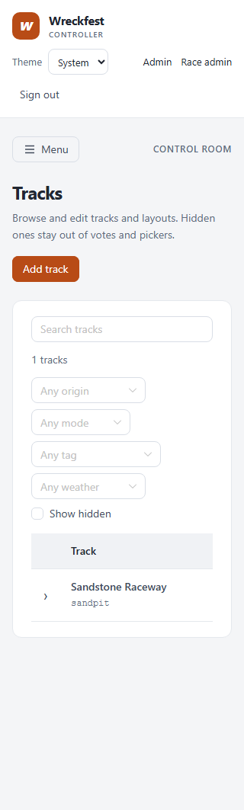
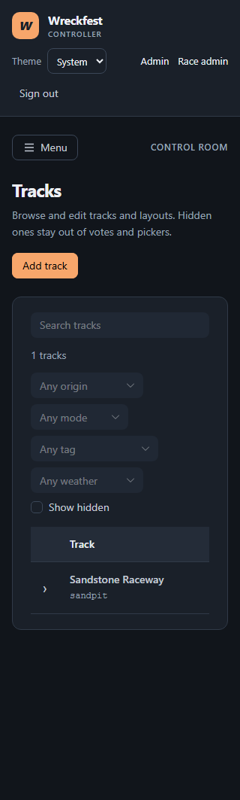
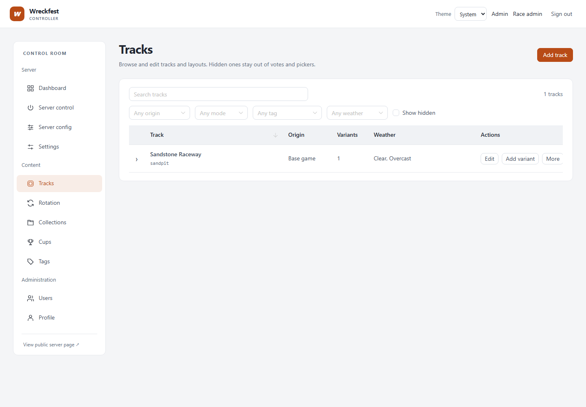
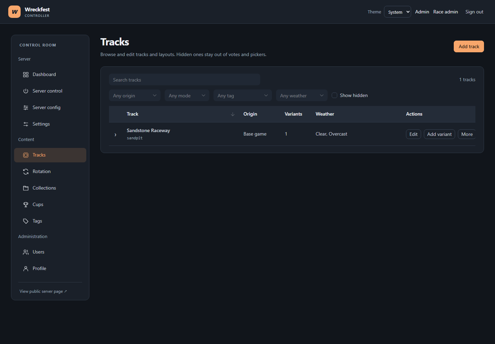

# Resource table redesign

The screenshots use fixture catalogue data and the production Vue build. They show the Tracks page before interacting with the table, at 320px and 1440px in both themes.

| View | Light | Dark |
| --- | --- | --- |
| Mobile (320px) |  |  |
| Desktop (1440px) |  |  |

The browser pass also checked the other admin routes for document overflow and page errors, menu Escape and selection focus, and filtered-empty/reset behavior.
