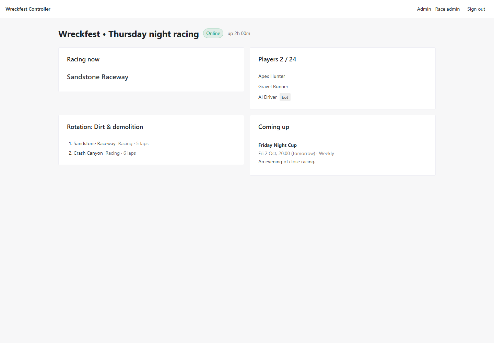
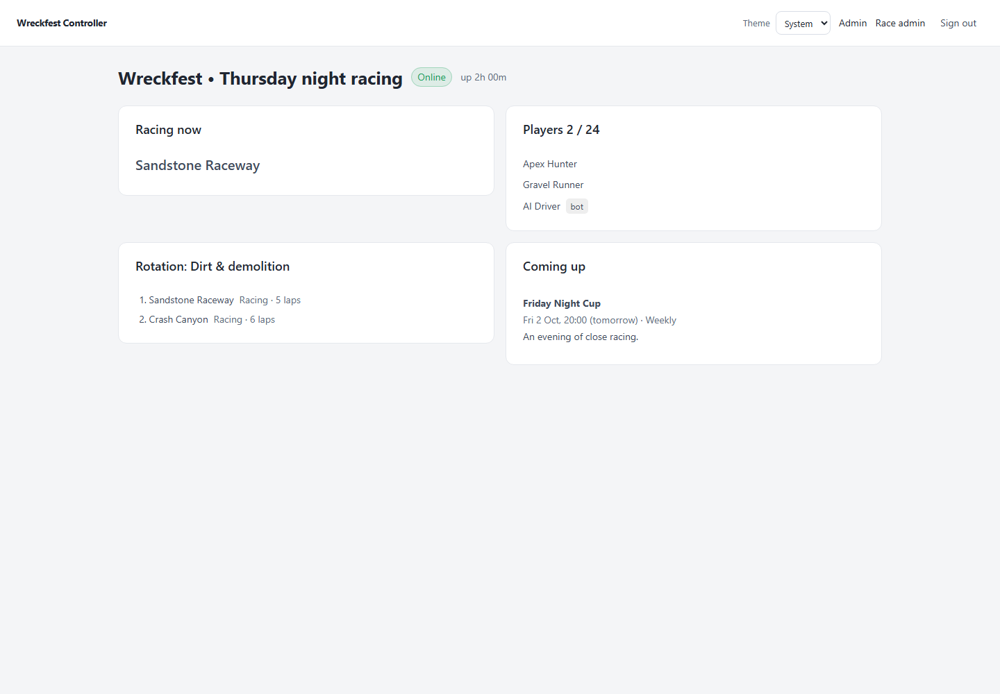
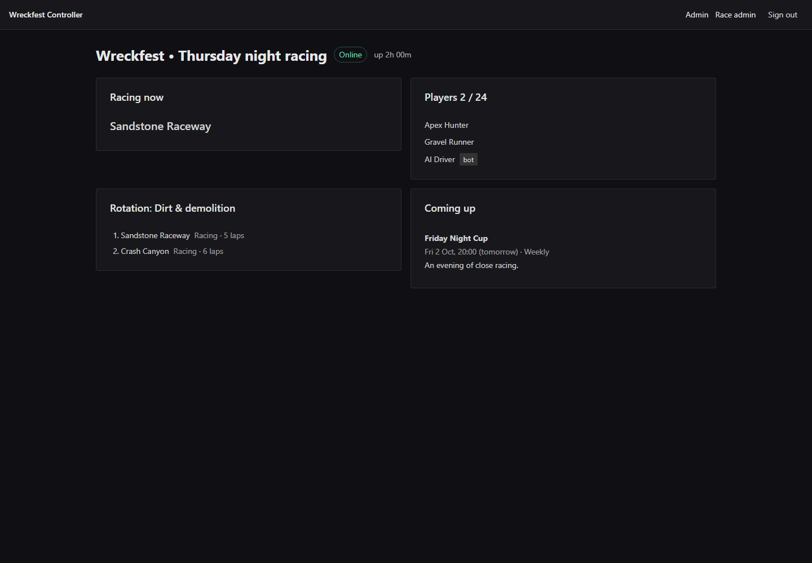
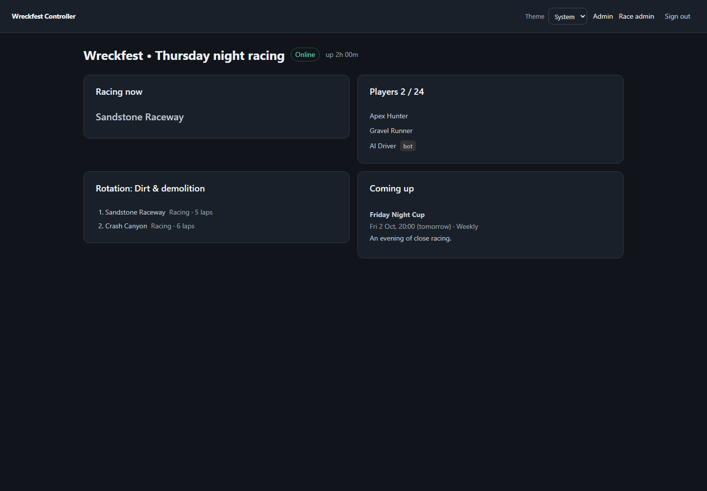
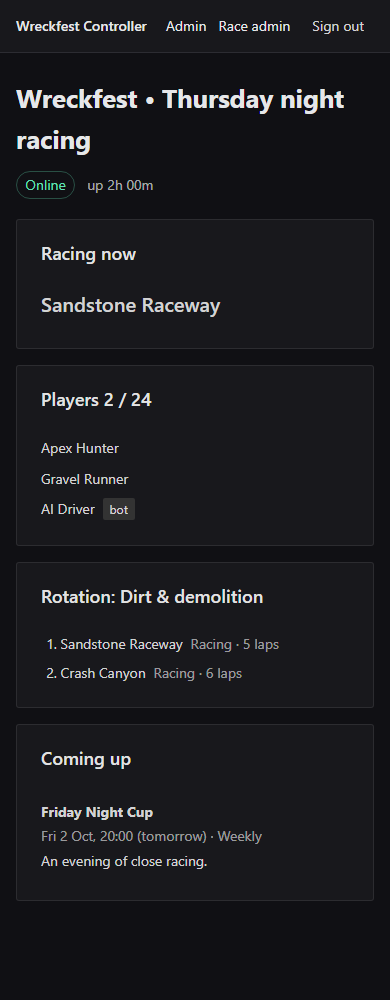
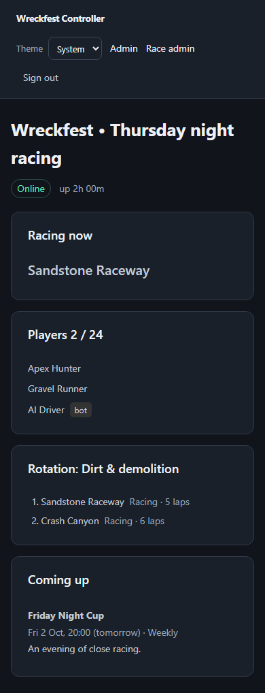
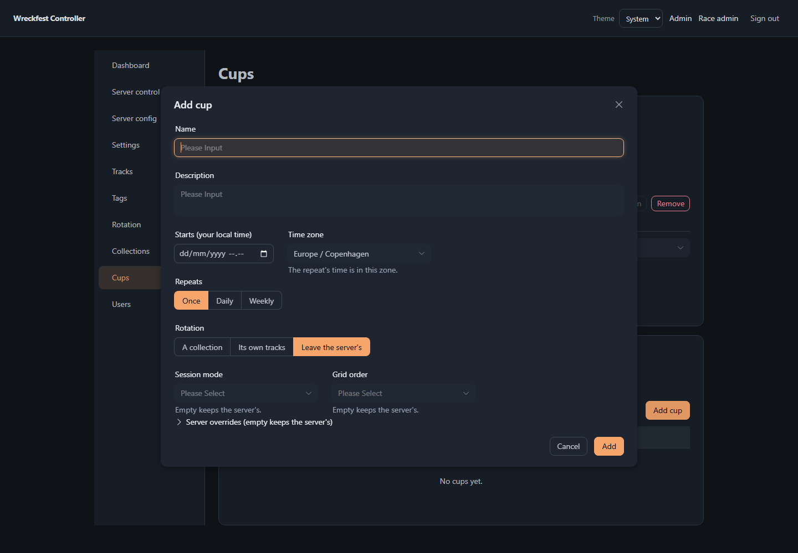

# Theme redesign evidence

Issue #174. Screenshots use deterministic browser fixtures, not production server data.
Baseline: master at 4c7e952. The code changes customize the existing Naive UI components.

| View | Before | After |
| --- | --- | --- |
| Home, light, 1440px |  |  |
| Home, dark, 1440px |  |  |
| Home, dark, 390px |  |  |

## Overlay

## Checks

- Production build passed.
- 31 Vitest files / 235 tests passed, including six appearance tests.
- Chromium: Home, Dashboard, Tracks, and Server Control at 390px and 1440px, in both OS themes. No page errors or document overflow in those fixtures.
- Explicit light/dark selection survives reload even when it disagrees with the OS.
- Cup modal inspected in both themes, including native date input and focused input.
- Existing dense admin layout is unchanged here; #175 addresses its mobile usability.
